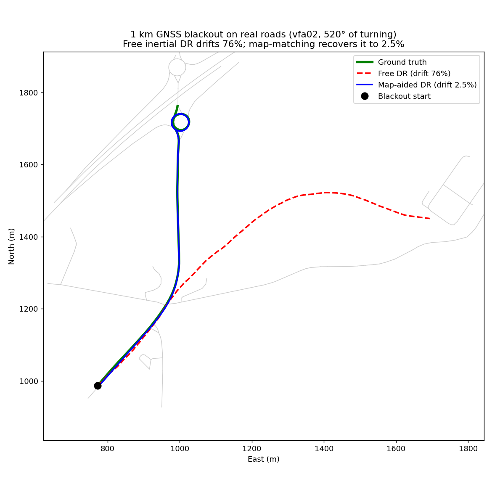
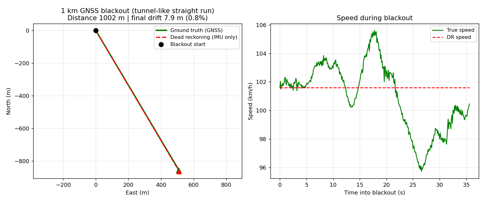
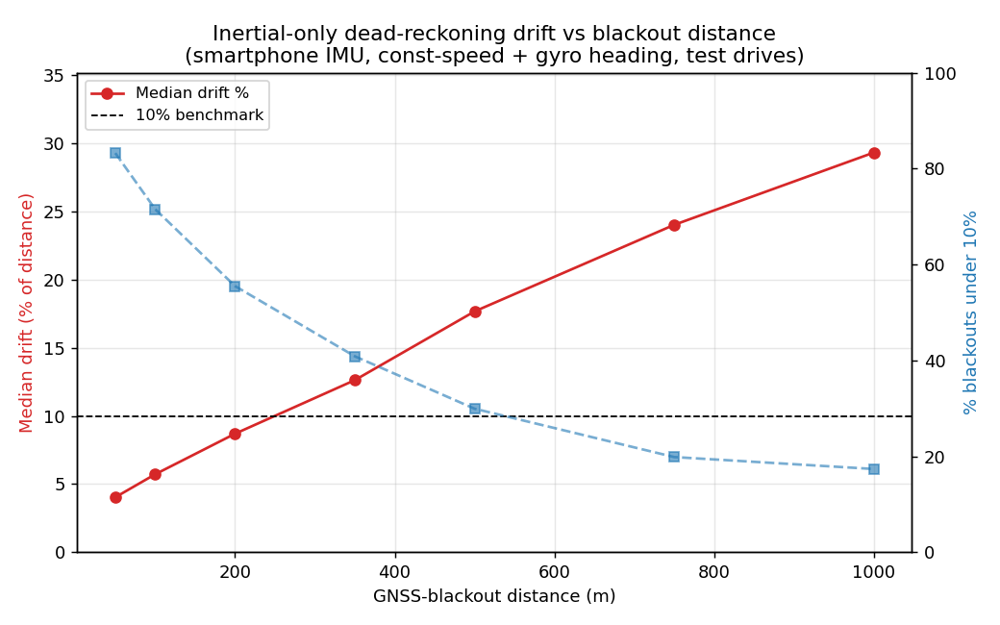
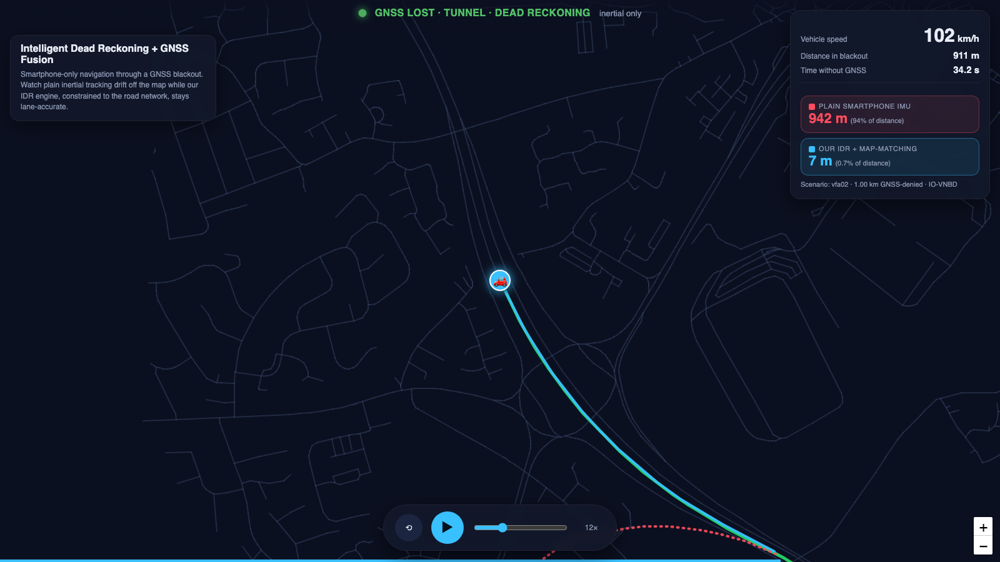

# Intelligent Dead Reckoning (IDR) with GNSS Fusion — SIH 2026, PS SIH26168 (ISRO)

**Team KANABI** · Problem statement: *AI-ML based Intelligent Dead Reckoning system for seamless navigation* (ISRO, Software, Miscellaneous)

A smartphone-only navigation engine that keeps lane-level position when GNSS disappears (tunnels, underpasses, parking decks, urban canyons, jamming) using the phone's accelerometer, gyroscope and magnetometer plus an offline OpenStreetMap road graph. No OBD-II, no wheel sensors, no fixed mount. Trained and evaluated on the official **IO-VNBD** dataset.



## Results on IO-VNBD (smartphone IMU only, held-out test drives)

| Scenario (simulated GNSS blackout on real drives) | PS benchmark | Achieved |
|---|---|---|
| 50 m blackout, motorway | < 5 m | **0.4 m (0.7 %)** |
| 1 km straight, tunnel-like run | < 100 m | **7.9 m (0.8 %)** |
| 1 km real roads with turns, map-aided (median over 369 blackouts) | < 10 % | **3.3 % highway · 4.8–7.0 % urban** |
| Share of 1 km blackouts under 10 % (free DR → map-aided) | — | **17 % → 74 %** |

Full numbers, the honest drift-vs-distance curve and the engineering findings are in [RESULTS.md](RESULTS.md). Figures: [docs/figures](docs/figures).

| 1 km tunnel-like run | Drift vs blackout distance (inertial-only) |
|---|---|
|  |  |

## How it works

```
phone IMU + GNSS ─► 1 Align & calibrate ─► 2 AI speed / vibration filter ─► 3 INS propagation
                     (gravity + PCA,         (1-D CNN, 32 k params,            (bias-corrected gyro heading,
                      bias, compass offset)   mount-invariant features)          last-GNSS speed anchor)
                 ─► 4 Map-matching + NHC ─► 5 AI error-state EKF fusion + GNSS deficit handler ─► position @ 10 Hz
                     (offline OSM graph,       (LSTM residual corrector, GOOD / DEGRADED / DENIED modes)
                      heading reset per edge)
```

* `src/alignment/` — in-vehicle alignment and calibration engine (phone → vehicle frame), with unit tests.
* `src/idr/` — IO-VNBD loader, IMU feature engineering, AI speed filter (`model.py`, `train.py`), dead-reckoning propagation and blackout calibration (`dead_reckoning.py`), OSM road graph + map-matching (`osm.py`, `map_matching.py`), evaluation and figures (`evaluate.py`, `evaluate_mapmatch.py`, `visualize.py`), demo export.
* `src/sensor_fusion/` — error-state EKF (`eskf.py`), INS mechanisation, non-holonomic constraints (`nhc.py`), GNSS quality gating (`gnss_quality.py`), LSTM IMU-error predictor, fusion engine and tests.
* `training/sensor_fusion/` — LSTM training, evaluation and ONNX/TFLite export.
* `scripts/` — dataset audits, inertial alignment recovery, CatBoost / causal-CNN / unrolled-INS experiments (see [TRAINING.md](TRAINING.md) and [reports/](reports)).
* `edge_engine/` — edge-deployable variant of the same core for external / FOG IMUs at ~200 Hz.
* `mobile_app/ui/` — Flutter Android app with the **engine running on the phone** (`lib/engine/`, pure Dart): alignment and calibration (mount pitch/roll/yaw), a 2-D GNSS+INS extended Kalman fusion filter with bias learning and multipath gating, automatic GNSS deficit handling, accelerometer-based speed with stop detection and pothole rejection, free and map-aided dead reckoning on an offline OSM graph, live drift read-out when GNSS returns, a drive logger (CSV) and a diagnostics sheet. See [mobile_app/ui/README.md](mobile_app/ui/README.md).
* `demo/` — browser replay of a real IO-VNBD drive through a 1 km blackout (open `demo/index.html`).



## Reproduce

```bash
pip install -r requirements.txt
python scripts/download_data.py            # pulls the synchronised IO-VNBD drives
python -m src.idr.train                     # AI speed & vibration filter
python -m src.idr.evaluate                  # 50 m / 1 km blackout plots + drift-vs-distance curve
python -m src.idr.evaluate_mapmatch         # 369 one-km blackouts, map-aided vs free DR
python -m src.idr.demo_export               # regenerates demo/replay_data.js
python -m pytest src/alignment src/sensor_fusion
```

Docker wrappers for the longer training experiments: `./build.sh` then `./run.sh prepare|train|train-cnn|train-ins` (see [TRAINING.md](TRAINING.md)).

## Status

* Done: dead reckoning + map-matching validated on IO-VNBD; alignment and fusion engines implemented in Python with tests; reproducible pipeline; replay demo; Android app running alignment, calibration, GNSS+INS Kalman fusion, dead reckoning and map-matching on-device (37 engine tests on synthetic drives).
* Next: real-vehicle tunnel test of the app and threshold tuning on logged drives; 200 Hz FOG-IMU edge build (dataset-agnostic CLI); multi-hypothesis map-matching; two-wheeler lean handling.

## Team KANABI

Abhilash (alignment & calibration) · Ritu (dead reckoning, map-matching, evaluation) · Anushtup (sensor fusion) · Nilesh (mobile app, integration)

## References

IO-VNBD (Onyekpe et al., Data in Brief 2021, github.com/onyekpeu/IO-VNBD) · Newson & Krumm, HMM map matching (2009) · Brossard, Barrau & Bonnabel, AI-IMU Dead-Reckoning (IEEE T-IV 2020) · Herath et al., RoNIN (ICRA 2020) · Solà, error-state Kalman filter (2017) · Groves, Principles of GNSS, Inertial and Multisensor Integrated Navigation Systems · OpenStreetMap contributors.
