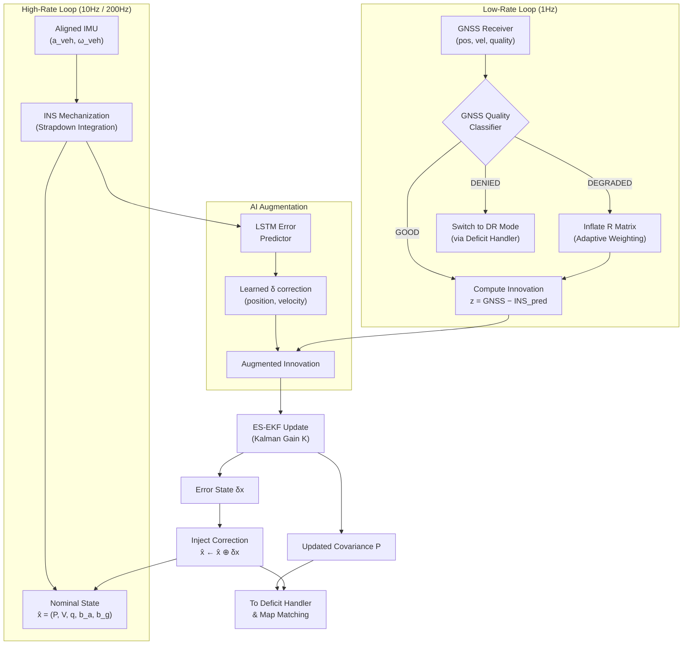
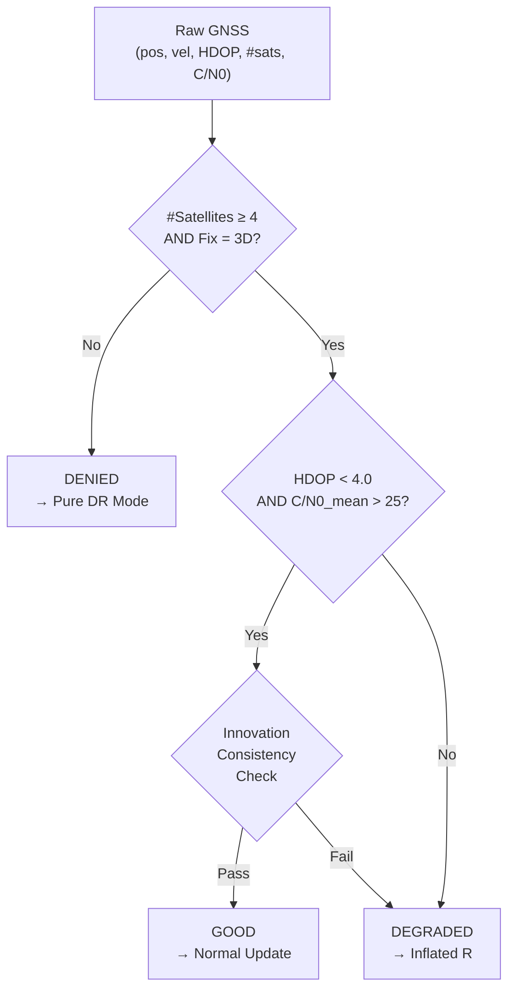
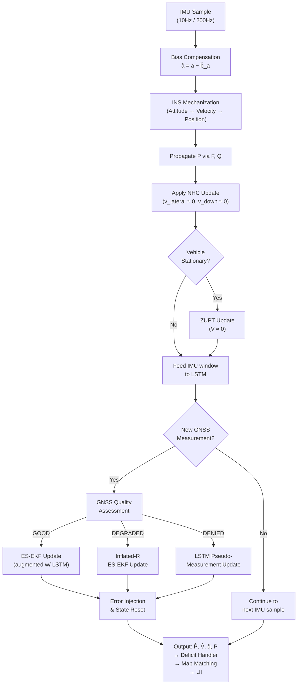
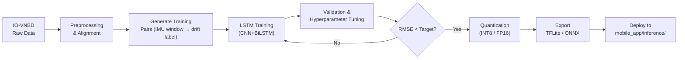

# Detailed Workflow: GNSS+INS Sensor Fusion Engine

The **GNSS+INS Sensor Fusion Engine** combines satellite-based positioning (GNSS) with Inertial Navigation System (INS) measurements to provide continuous, accurate position, velocity, and attitude estimates. It employs an **AI-Augmented Error-State Extended Kalman Filter (ES-EKF)** architecture where a neural network learns to compensate for consumer-grade MEMS sensor errors, enabling robust navigation during full GNSS availability, degraded signals, and complete GNSS blackouts.

This module receives **aligned sensor data** from the upstream **In-Vehicle Alignment & Calibration Engine** (`src/alignment/`), meaning all IMU readings are already in the vehicle reference frame $(Forward, Right, Down)_{vehicle}$.

---

## 1. System Inputs & Outputs

### 1.1 Inputs (from upstream modules)
- **Aligned 3-Axis Accelerometer** $\vec{a}_{veh}$: Vehicle-frame specific force at 10Hz (smartphone) or ~200Hz (edge/FOG).
- **Aligned 3-Axis Gyroscope** $\vec{\omega}_{veh}$: Vehicle-frame angular rates at 10Hz / ~200Hz.
- **GNSS Position** $(lat, lon, alt)$: Latitude, longitude, altitude from the smartphone receiver (~1Hz).
- **GNSS Velocity** $(v_N, v_E, v_D)$: North, East, Down velocity components from GNSS Doppler (~1Hz).
- **GNSS Quality Metrics**: HDOP, number of satellites, fix type (2D/3D), C/N0 per satellite.
- **Filtered Speed Estimate** $\hat{v}_{fwd}$: Clean forward velocity from the AI Speed & Vibration Filter (`src/filtering/`).
- **Rotation Matrix** $R_p^v$: Phone-to-vehicle transformation from the Alignment Engine.

### 1.2 Outputs
- **Fused Position** $\hat{P} = (\hat{lat}, \hat{lon}, \hat{alt})$: Continuous, corrected position estimate.
- **Fused Velocity** $\hat{V} = (\hat{v}_N, \hat{v}_E, \hat{v}_D)$: NED velocity vector.
- **Attitude Quaternion** $\hat{q}$: Vehicle orientation in the navigation frame.
- **IMU Bias Estimates** $(\hat{b}_a, \hat{b}_g)$: Real-time accelerometer and gyroscope bias corrections.
- **Covariance Matrix** $P$: State uncertainty — used by the Deficit Handler to assess solution quality and trigger mode transitions.
- **GNSS Health Flag**: Signal quality classification (GOOD / DEGRADED / DENIED) for downstream consumption.

---

## 2. Architecture Overview: AI-Augmented Error-State EKF

The core architecture is a **Loosely-Coupled Error-State Extended Kalman Filter** augmented by an LSTM-based neural network. The Error-State formulation is chosen over a conventional EKF because:
1. The error state $\delta x$ remains small and near-linear, yielding more accurate Jacobian linearization.
2. It avoids quaternion normalization issues in the state vector.
3. It naturally separates the high-rate IMU mechanization from the low-rate GNSS correction.

### 2.1 High-Level Data Flow



---

## 3. Phase 1: State Definition & Initialization

### 3.1 Error-State Vector (15-dimensional)

The total navigation state is partitioned into a **nominal state** (propagated by IMU mechanization) and an **error state** (estimated by the Kalman Filter):

$$
\delta x = \begin{bmatrix} \delta p \\ \delta v \\ \delta \theta \\ \delta b_a \\ \delta b_g \end{bmatrix} \in \mathbb{R}^{15}
$$

| Component      | Dimension | Description |
|:--------------:|:---------:|:------------|
| $\delta p$     | 3         | Position error (North, East, Down) in meters |
| $\delta v$     | 3         | Velocity error (NED) in m/s |
| $\delta \theta$| 3         | Attitude error (small-angle rotation vector) in rad |
| $\delta b_a$   | 3         | Accelerometer bias error in m/s² |
| $\delta b_g$   | 3         | Gyroscope bias drift error in rad/s |

### 3.2 Initialization

| Parameter | Source | Initial Value |
|:----------|:-------|:-------------|
| Position $\hat{P}_0$ | First valid GNSS fix | $(lat, lon, alt)_{GNSS}$ |
| Velocity $\hat{V}_0$ | GNSS Doppler or zero if stationary | $(v_N, v_E, v_D)_{GNSS}$ |
| Attitude $\hat{q}_0$ | Alignment Engine output | $R_p^v$ converted to quaternion |
| Bias $\hat{b}_{a,0}$ | Pre-calibration or zero | $[0, 0, 0]$ (learned online) |
| Bias $\hat{b}_{g,0}$ | Pre-calibration or zero | $[0, 0, 0]$ (learned online) |
| Covariance $P_0$ | Conservative diagonal | $\text{diag}(\sigma_p^2, \sigma_v^2, \sigma_\theta^2, \sigma_{ba}^2, \sigma_{bg}^2)$ |

**Typical Initial Uncertainties (Smartphone MEMS):**
- $\sigma_p = 10$ m, $\sigma_v = 1$ m/s, $\sigma_\theta = 5°$
- $\sigma_{ba} = 0.5$ m/s², $\sigma_{bg} = 0.01$ rad/s

---

## 4. Phase 2: INS Mechanization (Prediction / High-Rate Loop)

This is the **time-update** step, running at every IMU sample (10Hz smartphone / 200Hz edge). It propagates the nominal state forward using the strapdown inertial navigation equations.

### 4.1 Bias Compensation
Remove the currently estimated biases from raw IMU measurements:
$$
\tilde{a} = \vec{a}_{veh} - \hat{b}_a, \quad \tilde{\omega} = \vec{\omega}_{veh} - \hat{b}_g
$$

### 4.2 Attitude Propagation
Update the orientation quaternion using the bias-corrected gyroscope:
$$
\hat{q}_{k+1} = \hat{q}_k \otimes q(\tilde{\omega} \cdot \Delta t)
$$
where $q(\tilde{\omega} \cdot \Delta t)$ is the incremental rotation quaternion formed from the angular velocity vector, and $\otimes$ denotes quaternion multiplication.

### 4.3 Velocity Propagation
Rotate the specific force into the navigation (NED) frame, subtract gravity, and integrate:
$$
\hat{V}_{k+1} = \hat{V}_k + \left( R(\hat{q}_k) \cdot \tilde{a} - \vec{g} \right) \cdot \Delta t
$$
where $\vec{g} = [0, 0, 9.81]^T$ m/s² and $R(\hat{q}_k)$ is the rotation matrix from body to NED frame.

### 4.4 Position Propagation
Integrate velocity to update position:
$$
\hat{P}_{k+1} = \hat{P}_k + \hat{V}_k \cdot \Delta t + \frac{1}{2} \left( R(\hat{q}_k) \cdot \tilde{a} - \vec{g} \right) \cdot \Delta t^2
$$

### 4.5 Error-State Covariance Propagation
The error-state transition follows:
$$
\delta x_{k+1} = F_k \cdot \delta x_k + G_k \cdot w_k
$$

**State Transition Matrix** $F_k$ (15×15):
$$
F_k = \begin{bmatrix}
I & I \Delta t & 0 & 0 & 0 \\
0 & I & -R_k [\tilde{a}]_\times \Delta t & -R_k \Delta t & 0 \\
0 & 0 & I - [\tilde{\omega}]_\times \Delta t & 0 & -I \Delta t \\
0 & 0 & 0 & I & 0 \\
0 & 0 & 0 & 0 & I
\end{bmatrix}
$$

where $[\cdot]_\times$ denotes the skew-symmetric cross-product matrix.

**Process Noise** $Q_k$:
$$
Q_k = G_k \cdot \text{diag}(\sigma_{a,noise}^2, \sigma_{g,noise}^2, \sigma_{a,walk}^2, \sigma_{g,walk}^2) \cdot G_k^T \cdot \Delta t
$$

**Typical Smartphone MEMS Noise Parameters:**
| Parameter | Symbol | Value |
|:----------|:------:|:------|
| Accel white noise | $\sigma_{a,noise}$ | 0.02 m/s²/√Hz |
| Gyro white noise | $\sigma_{g,noise}$ | 0.001 rad/s/√Hz |
| Accel bias random walk | $\sigma_{a,walk}$ | 0.001 m/s³/√Hz |
| Gyro bias random walk | $\sigma_{g,walk}$ | 0.0001 rad/s²/√Hz |

Propagate covariance:
$$
P_{k+1|k} = F_k P_k F_k^T + Q_k
$$

---

## 5. Phase 3: GNSS Quality Assessment & Adaptive Weighting

Before incorporating GNSS measurements, the system must assess signal quality to prevent corrupted observations from degrading the solution.

### 5.1 GNSS Signal Health Classification



### 5.2 GNSS Quality Classification Rules

| Condition | Classification | Action |
|:----------|:--------------|:-------|
| No fix OR < 4 satellites | **DENIED** | Skip GNSS update; rely on INS + AI predictor |
| HDOP ≥ 4.0 OR C/N0 < 25 dB-Hz | **DEGRADED** | Inflate measurement noise $R$ by factor $\alpha$ |
| Innovation $z^T S^{-1} z > \chi^2_{threshold}$ | **DEGRADED** | Reject or down-weight outlier measurement |
| All checks pass | **GOOD** | Normal ES-EKF measurement update |

### 5.3 Adaptive Measurement Noise Matrix $R$

The measurement noise covariance is dynamically scaled based on signal quality:

$$
R_{adaptive} = R_{base} \cdot \alpha(HDOP, C/N_0)
$$

where:
- $R_{base} = \text{diag}(\sigma_{pos}^2, \sigma_{pos}^2, \sigma_{alt}^2, \sigma_{vel}^2, \sigma_{vel}^2, \sigma_{vel,D}^2)$
- Typical: $\sigma_{pos} = 2.5$ m, $\sigma_{alt} = 5.0$ m, $\sigma_{vel} = 0.1$ m/s
- $\alpha = \max\left(1.0, \frac{HDOP}{2.0}\right)^2$ — quadratic inflation for degraded signals.

---

## 6. Phase 4: Measurement Update (Correction / Low-Rate Loop)

When a valid (GOOD or DEGRADED) GNSS measurement arrives, the ES-EKF performs a measurement update to correct the accumulated INS drift.

### 6.1 Observation Model

The measurement vector consists of GNSS position and velocity:
$$
z_k = \begin{bmatrix} P_{GNSS} - \hat{P}_k \\ V_{GNSS} - \hat{V}_k \end{bmatrix} \in \mathbb{R}^{6}
$$

The observation matrix maps the error state to the measurement space:
$$
H = \begin{bmatrix} I_{3\times3} & 0 & 0 & 0 & 0 \\ 0 & I_{3\times3} & 0 & 0 & 0 \end{bmatrix} \in \mathbb{R}^{6 \times 15}
$$

### 6.2 Innovation & Consistency Check
The innovation (measurement residual) is:
$$
\nu_k = z_k - H \cdot \delta \hat{x}_{k|k-1}
$$

Innovation covariance:
$$
S_k = H P_{k|k-1} H^T + R_{adaptive}
$$

**Chi-squared gating** for outlier rejection:
$$
\gamma = \nu_k^T S_k^{-1} \nu_k
$$
If $\gamma > \chi^2_{6, 0.99} \approx 16.81$, the measurement is rejected as an outlier.

### 6.3 Kalman Gain & State Correction
$$
K_k = P_{k|k-1} H^T S_k^{-1}
$$
$$
\delta \hat{x}_{k|k} = K_k \cdot \nu_k
$$
$$
P_{k|k} = (I - K_k H) P_{k|k-1} (I - K_k H)^T + K_k R_{adaptive} K_k^T
$$
*(Joseph form used for numerical stability)*

### 6.4 Error-State Injection
Apply the estimated error correction to the nominal state:
$$
\hat{P}_k \leftarrow \hat{P}_k + \delta \hat{p}
$$
$$
\hat{V}_k \leftarrow \hat{V}_k + \delta \hat{v}
$$
$$
\hat{q}_k \leftarrow \hat{q}_k \otimes q(\delta\theta)
$$
$$
\hat{b}_a \leftarrow \hat{b}_a + \delta b_a
$$
$$
\hat{b}_g \leftarrow \hat{b}_g + \delta b_g
$$

After injection, reset the error state: $\delta x \leftarrow 0$.

---

## 7. Phase 5: AI Augmentation — LSTM Error Predictor

The neural network component addresses the fundamental limitation of the classical ES-EKF: its process model assumes linear, Gaussian noise, which poorly represents the complex, non-linear error dynamics of consumer MEMS IMUs under real driving conditions.

### 7.1 Purpose
The LSTM network is trained to predict the **IMU-induced position and velocity drift** that will accumulate over a given time window, based on the pattern of recent IMU readings. This learned correction is injected as a **pseudo-measurement** during GNSS outages or as an **innovation augmentation** during normal operation.

### 7.2 Network Architecture

```
Input Sequence (T timesteps):
  [a_x, a_y, a_z, ω_x, ω_y, ω_z, |a|, |ω|, Δt]  ×  T

    ↓
┌──────────────────────────┐
│  1D-CNN Feature Extractor │  ← Captures local vibration patterns
│  (Conv1D × 3 layers)      │
│  Kernel: 5, Filters: 64   │
└──────────────────────────┘
    ↓
┌──────────────────────────┐
│  Bi-LSTM Sequence Encoder │  ← Models temporal drift dynamics
│  (2 layers, 128 units)    │
│  Dropout: 0.2              │
└──────────────────────────┘
    ↓
┌──────────────────────────┐
│  Fully Connected Head     │
│  Dense(64) → ReLU         │
│  Dense(6) → Linear        │  ← Outputs: [δp_N, δp_E, δp_D, δv_N, δv_E, δv_D]
└──────────────────────────┘
```

**Input Features (per timestep):**
| Feature | Description |
|:--------|:-----------|
| $a_x, a_y, a_z$ | Aligned, bias-corrected specific force (vehicle frame) |
| $\omega_x, \omega_y, \omega_z$ | Aligned, bias-corrected angular velocity |
| $\|a\|$ | Acceleration magnitude (motion energy indicator) |
| $\|\omega\|$ | Angular velocity magnitude (turning indicator) |
| $\Delta t$ | Time delta (handles irregular sampling) |

**Sequence Length:** $T = 50$ samples (5 seconds at 10Hz; 0.25s at 200Hz — adjusted per target).

### 7.3 Training Strategy

**Training Data:**
- Source: IO-VNBD dataset with synchronized GNSS ground truth.
- Generate training pairs: given a window of IMU data, the label is the **accumulated drift** $= INS_{predicted} - GNSS_{truth}$ over that window.
- Augmentation: Random GNSS blackout injection (mask 10-60s segments), sensor noise perturbation, trajectory reversal.

**Loss Function:**
$$
\mathcal{L} = \lambda_p \|\delta \hat{p} - \delta p_{true}\|_2^2 + \lambda_v \|\delta \hat{v} - \delta v_{true}\|_2^2
$$
with $\lambda_p = 1.0$, $\lambda_v = 0.5$ (position accuracy weighted higher).

**Training Protocol:**
1. Train on 80% IO-VNBD driving segments, validate on 20%.
2. Optimizer: AdamW, LR: $1 \times 10^{-3}$ with cosine annealing.
3. Batch size: 64, Epochs: 100 with early stopping (patience=10).
4. Quantize to INT8 / FP16 for TFLite / ONNX export.

### 7.4 Integration with ES-EKF

**During GNSS Availability (GOOD/DEGRADED):**
The LSTM prediction is used to **augment the innovation**, providing a learned prior on expected drift:
$$
\nu_{augmented} = \nu_{GNSS} + \beta \cdot \delta_{LSTM}
$$
where $\beta \in [0, 0.3]$ is a blending weight (low to avoid double-counting).

**During GNSS Denial:**
The LSTM prediction acts as a **pseudo-measurement** replacement for GNSS:
$$
z_{pseudo} = \hat{P}_{INS} + \delta p_{LSTM}
$$
$$
R_{pseudo} = R_{base} \cdot \gamma(t_{outage})
$$
where $\gamma(t_{outage})$ increases with outage duration (degrading confidence over time):
$$
\gamma(t) = 1 + \alpha_{grow} \cdot t_{outage}^{1.5}
$$

---

## 8. Phase 6: Non-Holonomic Constraint (NHC) Updates

Vehicles obey kinematic constraints that can be exploited as **zero-velocity pseudo-measurements** to suppress lateral and vertical drift.

### 8.1 Constraints Applied
For a ground vehicle:
1. **No lateral sliding:** $v_{Right} \approx 0$ (the car doesn't slide sideways).
2. **No vertical flight:** $v_{Down} \approx 0$ (the car stays on the road surface).

### 8.2 NHC Measurement Model
$$
z_{NHC} = \begin{bmatrix} 0 \\ 0 \end{bmatrix} - \begin{bmatrix} v_{Right} \\ v_{Down} \end{bmatrix}
$$

With observation matrix:
$$
H_{NHC} = \begin{bmatrix} 0 & 0 & 0 & 0 & 1 & 0 & \cdots \\ 0 & 0 & 0 & 0 & 0 & 1 & \cdots \end{bmatrix}
$$

**Applied at every IMU sample** (10Hz / 200Hz) — this is particularly critical during GNSS outages to bound drift.

Measurement noise:
- $\sigma_{lateral} = 0.1$ m/s (tighter for highway, relaxed for parking maneuvers).
- $\sigma_{vertical} = 0.1$ m/s.

### 8.3 Zero Velocity Update (ZUPT)
When the vehicle is detected as stationary (via the AI Speed Filter reporting $\hat{v}_{fwd} < 0.1$ m/s AND $\|\omega\| < 0.02$ rad/s):

$$
z_{ZUPT} = \begin{bmatrix} 0 \\ 0 \\ 0 \end{bmatrix} - \hat{V}_k
$$

This is an extremely powerful correction that periodically resets velocity drift and accelerates bias convergence.

---

## 9. Complete Processing Pipeline (Per-Timestep Summary)



---

## 10. Interfaces with Other Modules

| Module | Interface | Direction |
|:-------|:---------|:----------|
| **Alignment Engine** (`src/alignment/`) | $R_p^v$ rotation matrix, displacement alerts | → Fusion |
| **AI Speed Filter** (`src/filtering/`) | Filtered $\hat{v}_{fwd}$, stationary detection | → Fusion |
| **Deficit Handler** (`src/deficit_handler/`) | GNSS health flag, covariance $P$, outage trigger | Fusion → |
| **Map Matching** (`src/map_matching/`) | Fused position $\hat{P}$, heading $\hat{\psi}$, uncertainty | Fusion → |
| **Training Pipeline** (`training/sensor_fusion/`) | Trained LSTM model weights (.tflite / .onnx) | → Fusion |
| **Mobile App** (`mobile_app/inference/`) | Exported quantized fusion model | Fusion → |

---

## 11. Performance Targets

| Metric | Target | Condition |
|:-------|:-------|:----------|
| Position accuracy (GNSS available) | < 3 m RMSE | Open sky, HDOP < 2 |
| Position drift (GNSS denied, 50m segment) | < 5 m | < 1 min outage |
| Position drift (GNSS denied, 1km segment) | < 100 m | 60 km/h, ~1 min outage |
| Velocity accuracy | < 0.5 m/s RMSE | All conditions |
| Bias convergence time | < 30 s | From cold start |
| Update rate (smartphone) | 10 Hz | Real-time on-device |
| Update rate (edge engine) | ~200 Hz | FOG-based IMU |
| GNSS→DR transition latency | < 1 ms | Seamless handover |

---

## 12. Training Pipeline Summary (`training/sensor_fusion/`)



**Key Training Artifacts:**
- `training/sensor_fusion/train_lstm.py` — Main training script.
- `training/sensor_fusion/dataset.py` — IO-VNBD data loader and windowing.
- `training/sensor_fusion/model.py` — CNN+BiLSTM architecture definition.
- `training/sensor_fusion/evaluate.py` — RMSE/drift evaluation against ground truth.
- `training/sensor_fusion/export.py` — TFLite/ONNX quantization and export.

